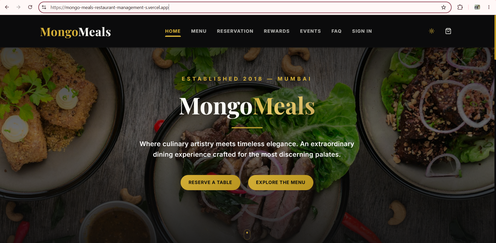
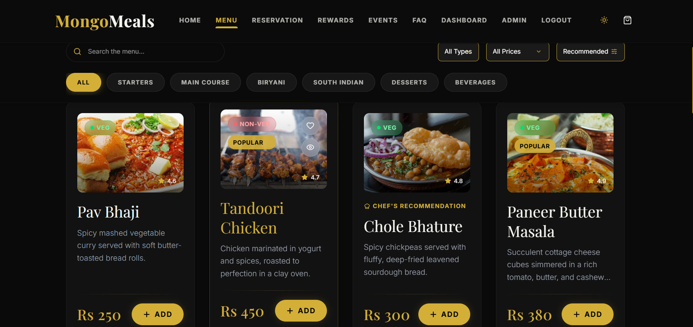
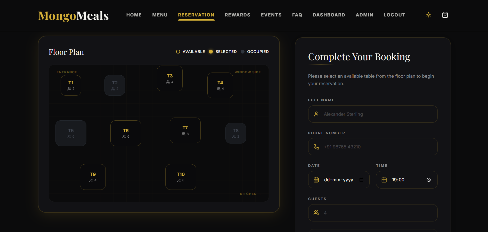
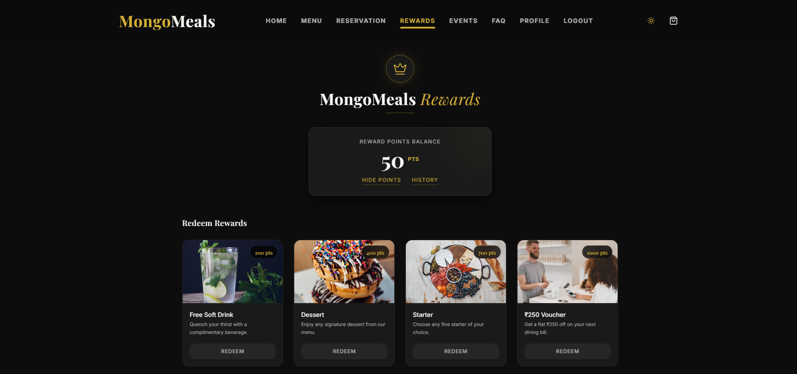
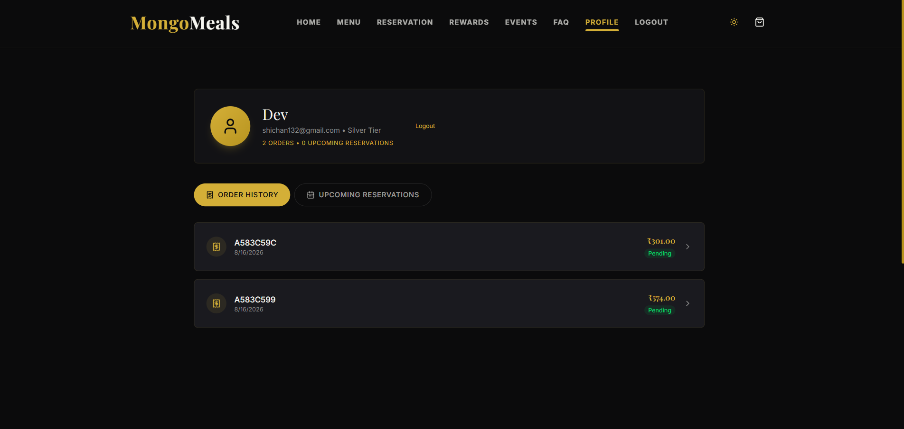
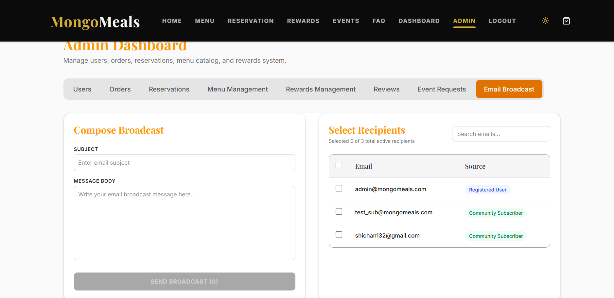

# 🍽️ MongoMeals – MERN Restaurant Management System

*MongoMeals* is a full-stack restaurant management web application built using the *MERN Stack – MongoDB, Express.js, React.js, and Node.js*.

The project provides a complete digital restaurant experience for both *customers and administrators*.

Customers can explore the food menu, place orders, reserve tables, request event bookings, earn loyalty points, submit reviews, and manage their profiles.

Administrators can manage users, orders, reservations, reviews, event requests, rewards, and email communication through a dedicated *Admin Dashboard*.

---

## 🌐 Live Project

### ▶️ Click below to open MongoMeals

[🍽️ *Open MongoMeals Live*](https://mongo-meals-restaurant-management-s.vercel.app/)

---

# 📸 Project Preview

## 🏠 Home Page

A modern restaurant landing page that provides access to the menu, reservations, events, rewards, and other important features.

---

## 🥘 Restaurant Menu

Customers can explore food items and use search, category, price, food-type, and sorting options.

---

## 📅 Table Reservation

Customers can select a date, time, and restaurant table using the interactive reservation system.

---

## 🎁 Loyalty Rewards

Registered customers can earn loyalty points through different activities and use those points to unlock rewards.

---

## 👤 Customer Profile

The customer profile displays account information, loyalty status, order history, reservations, and rewards progress.

---

## 🛡️ Admin Dashboard

The Admin Dashboard provides centralized management of users, orders, reservations, reviews, event requests, rewards, subscribers, and email communication.

---

# 🚀 Key Modules & Features

## 🔐 1. User Authentication & Profile

MongoMeals provides secure user registration and login.

The authentication system uses:

- *JWT (JSON Web Token)* for authentication
- *bcryptjs* for password hashing
- Protected routes for authorized users
- Separate customer and administrator access

### Basic Authentication Flow

text
User Registration / Login
          ↓
Express Backend
          ↓
Check User Information
          ↓
bcrypt Password Verification
          ↓
Generate JWT
          ↓
Authenticated User
          ↓
Access Protected Features

Passwords are not stored directly as plain text. *bcryptjs* hashes passwords before they are stored in MongoDB.

---

## 🥘 2. Gourmet Menu

MongoMeals provides an interactive restaurant menu where customers can explore different dishes.

Menu categories include:

- Starters
- Main Course
- Biryani
- South Indian
- Desserts
- Beverages

Customers can use different options to quickly find suitable food.

### 🔎 Search

Customers can search menu items using their names or descriptions.

### 🥗 Food Type Filter

Customers can filter between:

- Vegetarian / Vegan
- Non-Vegetarian

### 💰 Price Filter

Food can be filtered according to different price ranges.

### ↕️ Sorting

Menu items can be sorted by:

- Recommended
- Price – Low to High
- Price – High to Low
- Name – A to Z

---

## 🛒 3. Cart & Ordering

Customers can add food items to their cart before placing an order.

MongoMeals includes a *cart drawer*, allowing users to quickly view selected items without leaving the current page.

### Basic Flow

text
Browse Menu
     ↓
Select Food
     ↓
Add to Cart
     ↓
Review Cart
     ↓
Place Order
     ↓
Order Stored in MongoDB

Customers can later view their order information through their profile.

---

## 📅 4. Table Reservation System

MongoMeals includes an interactive table reservation system.

Customers can select:

- Reservation date
- Reservation time
- Restaurant table

The application prevents customers from selecting dates in the past.

It also protects against two customers booking the *same table for the same date and time*.

### 🔒 Duplicate Booking Protection

MongoDB uses a compound unique index based on:

javascript
{
  date: 1,
  time: 1,
  table: 1
}

This means the combination of:

text
Date + Time + Table

must be unique for an active reservation.

### Example

text
Customer A
Date: 20 August
Time: 8:00 PM
Table: 5
        ↓
Reservation Created
        ↓
Customer B tries:
20 August + 8:00 PM + Table 5
        ↓
MongoDB Detects Duplicate
        ↓
Booking Rejected

This provides database-level protection against duplicate reservations, even when multiple booking requests arrive almost at the same time.

Cancelled reservations can be excluded so the table becomes available again.

---

## 🎁 5. Loyalty Points & Rewards

MongoMeals contains a customer loyalty and rewards system.

Customers can earn points through different activities:

- *Sign Up* → +50 points
- *First Reservation* → +100 points
- *Every Reservation* → +50 points
- *Approved Review* → +50 points

Customers can use their accumulated points to unlock rewards.

| Reward | Required Points |
|---|---:|
| Soft Drink | 200 |
| Dessert | 400 |
| Starter | 700 |
| ₹250 Voucher | 1000 |

---

## 🏆 6. Customer Loyalty Tiers

MongoMeals automatically determines the customer's loyalty tier according to their accumulated points.

| Tier | Points |
|---|---:|
| 🥈 Silver | Below 1500 |
| 🥇 Gold | 1500 – 3999 |
| 💎 Platinum | 4000+ |

### Loyalty Flow

text
Customer Activities
        ↓
Earn Points
        ↓
Points Stored
        ↓
Calculate Loyalty Tier
        ↓
Silver / Gold / Platinum

---

## ⭐ 7. Reviews

Customers can submit reviews about their restaurant experience.

Administrators can view submitted reviews and approve or reject them.

When a review is approved, the customer can receive:

*+50 Loyalty Points*

### Workflow

text
Customer Review
      ↓
Submitted
      ↓
Admin Dashboard
      ↓
Approve / Reject
      ↓
Approved
      ↓
+50 Loyalty Points

---

## 🎉 8. Event Booking Requests

MongoMeals supports requests for private restaurant events.

Customers can request restaurant spaces such as:

- Terrace
- Lounge
- Pavilion

The event request is stored in the database and can be viewed and managed through the Admin Dashboard.

### Workflow

text
Customer
    ↓
Select Event / Venue
    ↓
Send Request
    ↓
Express API
    ↓
MongoDB
    ↓
Admin Dashboard
    ↓
Manage Request

---

## 📧 9. Newsletter Subscription

The website contains a *Join Our Community* subscription feature.

Visitors can enter their email addresses to subscribe.

Subscriber information is stored using a MongoDB *CommunitySubscriber* model.

The system handles:

- New subscriptions
- Duplicate email addresses
- Existing subscribers
- Subscriber reactivation

---

## ✉️ 10. Admin Email Broadcast System

MongoMeals includes an email broadcasting feature inside the Admin Dashboard.

The system collects email addresses from:

- Registered customers
- Community newsletter subscribers

If the same email exists in both places, MongoMeals removes the duplicate and displays it only once.

The administrator can:

- View recipient emails
- Search email addresses
- Select individual recipients
- Select all recipients
- View the number of selected recipients
- Enter an email subject
- Write email content
- Send emails to selected users

### 📤 Nodemailer Email Delivery

*Nodemailer* is used to send emails through SMTP.

text
Registered Users
       +
Community Subscribers
       ↓
Collect Email Addresses
       ↓
Remove Duplicates
       ↓
Admin Selects Recipients
       ↓
Subject + Message
       ↓
Nodemailer
       ↓
SMTP / Gmail
       ↓
Email Delivered

The system can skip invalid email addresses so one incorrect address does not stop the complete email process.

---

## 🛡️ 11. Admin Dashboard

MongoMeals provides a dedicated administration dashboard.

Admin features include:

- 👥 User management
- 🛒 Order management
- 📅 Reservation management
- ⭐ Review management
- 🎉 Event request management
- 🎁 Rewards management
- 📧 Email broadcasting
- 📰 Community subscriber management

This creates a clear separation between *customer functionality* and *restaurant administration*.

---

## 🌗 12. User Interface & Experience

MongoMeals provides a modern and responsive restaurant interface.

The frontend includes:

- Responsive design
- Dark and light themes
- Smooth animations
- Interactive components
- Modern restaurant layout
- Glass-style interface elements
- Cart drawer
- Mobile-friendly design

*Tailwind CSS v4* is used for styling and customization.

*Framer Motion* is used for animations and smooth transitions.

*Lucide React* is used for interface icons.

---

## ⚛️ 13. React Frontend

The frontend of MongoMeals is built using *React.js with Vite*.

React is used to create reusable components and dynamically update the user interface.

Examples include:

- Navigation
- Menu cards
- Search and filters
- Cart
- Reservation interface
- Customer profile
- Rewards
- Admin components

*React Router DOM* is used for navigation between different pages.

### Frontend Flow

text
User Action
     ↓
React Component
     ↓
API Request
     ↓
Backend
     ↓
Response
     ↓
React Updates UI

---

## 🟢 14. Node.js & Express Backend

*Node.js* provides the JavaScript runtime for the backend.

*Express.js* is used to create backend routes and REST APIs.

The backend handles:

- Authentication
- User management
- Menu data
- Orders
- Reservations
- Reviews
- Events
- Rewards
- Newsletter subscribers
- Email broadcasting

### Backend Flow

text
React Frontend
      ↓
HTTP Request
      ↓
Express Route
      ↓
Backend Logic
      ↓
Mongoose
      ↓
MongoDB
      ↓
Response
      ↓
React Frontend

---

## 🍃 15. MongoDB Database

MongoMeals uses *MongoDB* as its database.

*Mongoose* is used to communicate between the Node.js/Express backend and MongoDB.

The database stores information such as:

- Users
- Menu items
- Orders
- Reservations
- Reviews
- Event requests
- Rewards
- Community subscribers

### Database Flow

text
Express Backend
       ↓
Mongoose Model
       ↓
MongoDB
       ↓
Stored Data

---

## 🔗 16. REST API Communication

The React frontend and Express backend communicate through *REST APIs* using HTTP requests.

Common HTTP methods include:

text
GET     → Read data
POST    → Create data
PUT     → Update data
DELETE  → Delete data

### Example

text
React Frontend
      ↓
POST Reservation
      ↓
Express API
      ↓
Validate Request
      ↓
Mongoose
      ↓
MongoDB
      ↓
Return Response
      ↓
React Updates UI

---

# 🛠️ Technology Stack

| Category | Technology |
|---|---|
| Programming | JavaScript |
| Frontend | React.js |
| Build Tool | Vite |
| Styling | Tailwind CSS v4 |
| Animation | Framer Motion |
| Icons | Lucide React |
| Routing | React Router DOM |
| Backend Runtime | Node.js |
| Backend Framework | Express.js |
| Database | MongoDB |
| ODM | Mongoose |
| Authentication | JWT |
| Password Security | bcryptjs |
| Email Delivery | Nodemailer |
| Version Control | Git, GitHub |
| Frontend Deployment | Vercel |

---

# 🏗️ Simplified System Architecture

text
                         MONGOMEALS
                              │
              ┌───────────────┴───────────────┐
              │                               │
          FRONTEND                         BACKEND
              │                               │
        React + Vite                     Node.js
       Tailwind CSS                     Express.js
       Framer Motion                         │
              │                               │
              └───────────────┬───────────────┘
                              │
                           REST API
                              │
                  ┌───────────┴───────────┐
                  │                       │
              DATABASE                 SERVICES
                  │                       │
               MongoDB                 Nodemailer
                  │                       │
               Mongoose                  SMTP
                  │
        ┌─────────┼─────────┐
        │         │         │
      Users     Orders   Reservations
        │                   │
      Rewards             Events

---

# 📁 Project Structure

text
MongoMeals/
│
├── assets/
│   ├── mongomeals-home.png
│   ├── mongomeals-menu.png
│   ├── mongomeals-reservation.png
│   ├── mongomeals-rewards.png
│   ├── mongomeals-profile.png
│   └── mongomeals-admin.png
│
├── public/
│   └── ...
│
├── src/
│   ├── components/
│   ├── context/
│   ├── data/
│   ├── pages/
│   ├── services/
│   ├── App.jsx
│   └── main.jsx
│
├── server/
│   ├── models/
│   ├── routes/
│   ├── middleware/
│   ├── seed.js
│   └── ...
│
├── package.json
├── package-lock.json
├── vite.config.js
├── vercel.json
├── .env.example
├── .gitignore
└── README.md

> *Note:* The exact folder structure may vary depending on the current version of the project.

---

# ⚙️ Installation & Setup

## 1. Clone the Repository

bash
git clone https://github.com/brahmbhattchaitanya2-art/MongoMeals-Restaurant-Management-System.git
cd MongoMeals-Restaurant-Management-System

---

## 2. Backend Setup

Open the server directory:

bash
cd server

Install backend dependencies:

bash
npm install

Create a .env file inside the server directory:

env
MONGO_URI=your_mongodb_connection_string
PORT=5000
JWT_SECRET=your_jwt_secret
EMAIL_USER=your_email
EMAIL_PASS=your_email_app_password
NODE_ENV=development

> ⚠️ Never upload your real .env, MongoDB password, JWT secret, or Gmail App Password to GitHub.

Start the backend:

bash
npm start

---

## 3. Frontend Setup

Return to the project root:

bash
cd ..

Install frontend dependencies:

bash
npm install

Start the Vite development server:

bash
npm run dev

---

## 4. Production Build

bash
npm run build

---

# 🔑 Environment Variables

| Variable | Purpose |
|---|---|
| MONGO_URI | MongoDB database connection |
| PORT | Backend server port |
| JWT_SECRET | Secret key used for JWT authentication |
| NODE_ENV | Development or production environment |
| EMAIL_USER | Email account used by Nodemailer |
| EMAIL_PASS | Gmail App Password used by Nodemailer |

---

# 🌐 Deployment

MongoMeals is deployed as a full-stack web application.

The *React/Vite frontend* is deployed using *Vercel*.

### 🚀 Live Application

[*Open MongoMeals Live*](https://mongo-meals-restaurant-management-s.vercel.app/)

The deployed frontend communicates with backend APIs to access restaurant data and functionality.

---

# 🔒 Security & Validation

MongoMeals includes several security and validation features:

- Password hashing using bcryptjs
- JWT-based authentication
- Protected application routes
- Environment variables for sensitive configuration
- Reservation date validation
- Database-level duplicate reservation protection
- Email validation
- Separate customer and administrator functionality

---

# 🎯 Project Objective

The main objective of *MongoMeals* is to demonstrate how a modern full-stack web application can manage both the *customer experience and restaurant operations*.

The project combines:

- React frontend development
- Tailwind CSS styling
- Node.js and Express backend development
- MongoDB database management
- REST API communication
- User authentication
- Password hashing
- Restaurant menu and ordering
- Table reservations
- Duplicate booking protection
- Loyalty points and rewards
- Customer reviews
- Event booking requests
- Admin management
- Newsletter subscriptions
- Email broadcasting
- Responsive UI design
- Full-stack deployment

MongoMeals demonstrates how *React, Node.js, Express.js, and MongoDB* can work together to create a complete restaurant management application.

---

# ⚠️ Disclaimer

MongoMeals is an *educational full-stack development project*.

Restaurant information, menu items, prices, rewards, event information, and other content used in the application are for demonstration purposes.

Private environment variables and credentials should never be committed to a public GitHub repository.

---

# 👨‍💻 Built With

*React.js • Vite • Tailwind CSS • JavaScript • Node.js • Express.js • MongoDB • Mongoose • JWT • bcryptjs • Nodemailer • Framer Motion • Lucide React • Git • GitHub • Vercel*

---

### 🍽️ MongoMeals

*A Full-Stack MERN Restaurant Management System for Customers and Administrators.*